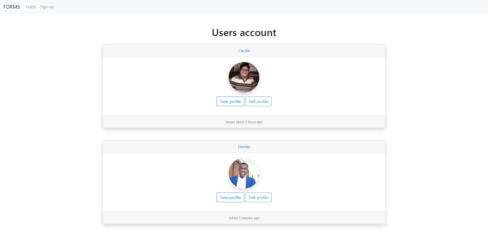

#  🧐 FORMS

This is the third collaborative project from the Ruby on Rails module from the Microverse program. It consists on making a page with users who can register, login and logout, with a basic user model, user controller and also some views like the list of users, the register form, the edit form and the single profile view.


## 🔧 Built With
- Ruby. v2.6.6
- Ruby on Rails. v6.0.3.3
- Using Rubocop Linters.
- Bootstrap

## 🔴 Live Demo
[Video Demo Link](https://drive.google.com/file/d/1I1Ga5NLKy_4UIkxOU9Evofn70QlL06j4/view?usp=sharing)

## 🛠 Getting Started
## Install 
Besides the Video Demo Link, you can run those functions in your own local environment. In order to run, you need to install Ruby in your computer. For windows you can go to [Ruby installer](https://rubyinstaller.org/) and for MAC and LINUX you can go to [Ruby official site](https://www.ruby-lang.org/en/downloads/) for intructions on how to intall it. Then you can clone the project by typing ```git clone https://github.com/Ceci007/forms.git``` on your terminal.

## Run the application
To get a local copy up and running follow these simple example steps.

- Open a terminal
- Copy this code : ```git clone "put the link from github repo"```
- Run the program with this code : ```bundle install```
- Run the program with this code : ```rails db:create rails db:migrate rails server```
- Stop the program with: "Ctrl + C" (Windows or Linux) or "Command + C"(Apple)

## Open app in browser

- When the program is running go to your browser
- put: localhost:3000/
- Click on login, register and create a new article
- Enjoy the app.

## ✒️ Authors
👤 **Cecilia Benitez Casaccia**

- Github: [@Ceci007](https://github.com/Ceci007)
- LinkedIn:[LinkedIn](www.linkedin.com/in/cecilia-benítez)

👤 **Stanley Enow Lekunze**

- Github: [@happiguru](https://github.com/happiguru)
- LinkedIn:[LinkedIn](https://www.linkedin.com/in/lekunze-nley)

## 🤝 Contributing
Contributions, issues and feature requests are welcome!

Feel free to check the [issues page](https://github.com/Ceci007/forms/issues).

## 📝 License
This project is [MIT](lic.url) licensed.